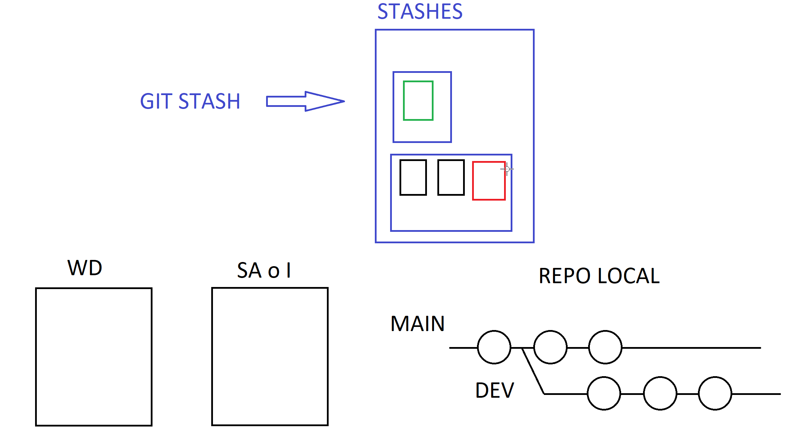

# Clase 03

## Herramientas con interfaz gráfica

Git Kraken <https://www.gitkraken.com/>
Git Desktop <https://desktop.github.com/>

## RAMAS (Branches) Continuación...

### GIT SWITCH (Cambiar entre ramas)

```sh
git switch <rama>
```

> Para cambiarme entre la rama actual y la anterior

```sh
git switch -
```

> Para crear una rama y moverse a ella en un solo comando

```sh
git switch -c <nombre-de-la-rama>
```

> Ayuda del comando switch 

```sh
git switch --help
```

## Subir una rama al remoto.

```sh
git push -u <alias-remoto> <rama-que-quiero-subir> ## git push --set-upstream origin <rama-que-quiero-subir>
git push -u origin dev
```

## GIT FETCH: Traerme metadata del repo remoto
O sea sicronizar la carpeta .git local con la .git remoto

```sh
git fetch 
git fetch --all
```

## Ver todas las ramas disponibles, incluidas las del remoto en forma detallada
O sea sicronizar la carpeta .git local con la .git remoto

```sh
git branch -av # dónde -a es all y -v es verbose 
```

## Puedo traerme los cambios de una rama en particular

```sh
git pull # Estando en la rama que quiero actualizar. O sea si estoy en dev, se va a actualizar con el remoto, dev
git pull origin dev # No importa sobre que rama estoy, puedo indicarle que sincronizar.
git pull origin feature 
```

# GIT STASH
Es una pila de almacenamiento que provee GIT. 
Permite registrar temporalmente los cambios del WD y del SA.





## Ver los stash

```sh
git stash list
```

## Enviar al stash

```sh
git stash # Envia todo lo que esta en el WD, menos los untracked y lo que esta en SA
git stash -u # Si quiero incluir los archivos untracked tengo que poner -u
``` 

## Desapilar o aplicar el último stash

```sh
git stash pop # aplica y borra el último stash
```

## Aplicar o desapilar un stash en particular

```sh
git stash apply # igual pop (aplica el último) pero sin borrarlo
git stash apply stash@{1}
```

## Borrar un stash en particular

```sh
git stash drop # borra el último stash
git stash drop stash@{3}
```

## Ver el contenido del stash

```sh
git stash show -p stash@{1} #Le indico que stash quiero ver
```

## Crear una rama a partir de un stash

```sh
git stash branch <rama-donde-quiero-guardar-lo-que-tengo-en-el-stash>
``` 
