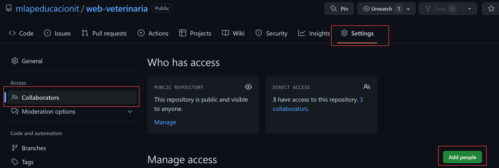

# Clase 04

## Entregas

* Además de los desafios
* Entrega de Integradores en un repo de github
    * HTML
    * C#
    * MYSQL
    * GIT

* Usando los grupos de MYSQL. Se crear un repo. Agregan a la persona que va ser su colaborar.

La entrega van a ser los links de los repos.

## Para resolver el desafío del módulo 3

1. Clonar el repo: https://github.com/mlapeducacionit/web-veterinaria
2. agregar en la rama main el **status.js** 
3. crear la rama custom-navbar
4. empezar a trabajar
5. crear el stash para resolver la incidencia que nos piden.

# GIT RESET
Nos permite resetear (volver atrás cambios: volver atraás commits)
Nota: Recuerden que tengo que seleccionar el hash anterior al que quiero hacerle reset.
## SOFT

```sh
git reset --soft <hash>
```

## MIXED

```sh
git reset <hash>
git reset --mixed <hash>
```

## HARD
PELIGROSO. Hay que tratarlo con respeto. Pierdo toda la información.

```sh
git reset --hard <hash>
```


# REFLOG: Mira la historia global del REPO

```sh
git reflog
```

# Trabajo colaborativo con personas que conozco

## Agreando colaboradores al repo de Github
Atención: Tengo que conocer muy bien a las personas porque van a tener permisos sobre todas las ramas.



# Trabajo colaborativo con personas que no conozco (No tengo la confianza suficiente)
Trabajando con proyectos Open Source

1. Hacer un fork del proyecto. Del proyecto del cual quiero contribuir (Me voy copiar en mi cuenta el repo del proyecto original)
2. Me clono el fork desde mi cuenta github
3. Trabajo normalmente. Subo los cambios (A repo propio)
4. Me voy al proyecto original en el apartado Pull Request. Creo un nuevo Pull Request. Algunas veces aparece en mi repo la posibilidad Pull Request.
---
5. Si el repo original sufrió más modificaciones. (Commits). Voy a tener que actualizar mi fork.
6. Voy a la cuenta del proyecto original y me copio la url del repositorio
7. Y agrego en mi repositorio local, la url (el remoto) del proyecto original.

    git remote add upstream <URL-repositorio-original>

8. Me traigo los cambios del repositorio original a mi repo local

    git pull upstream <rama-que-quiero-actualizar>

9. Subo a mi repositorio remoto (Fork) las actualizaciones del repo local

    git push origin <rama-a-actualizar>


# GITHUB CLI
Es una herramienta para interactuar con los repsositorios remotos de GITHUB

<https://cli.github.com/>

# GIST
Compartir código, pasar snippets a otras personas o información que quiero compartir.

<https://gist.github.com/>

Secretos => Solo la persona que tienen link puede verlo. No son privados
Publicos => Se van indexar en los motores de búsqueda.

Pueden tener varios archivos y sus revisiones.


